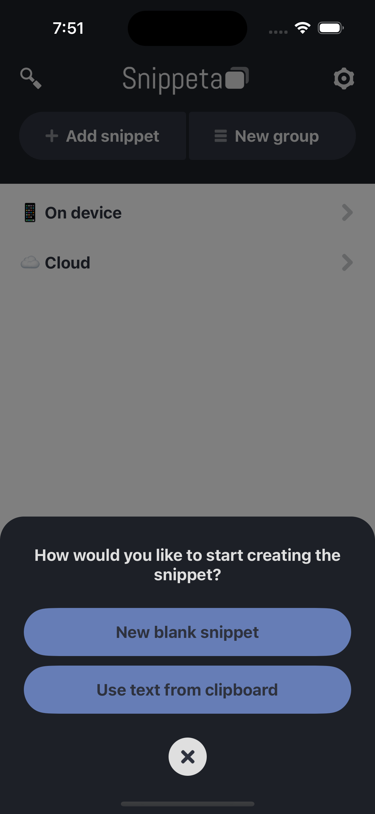

# Fancy Action Sheet for React Native

[](https://www.npmjs.com/package/react-native-fancy-action-sheet)
[](https://www.npmjs.com/package/react-native-fancy-action-sheet)
[](LICENSE)
[](https://github.com/kelvingraddick/react-native-fancy-action-sheet/issues)
[](https://github.com/kelvingraddick/react-native-fancy-action-sheet/stargazers)

## Introduction

**Fancy Action Sheet** is a customizable, flexible (and better looking) action sheet component for React Native. This component is easy to integrate, highly customizable, and comes with support for both standard and destructive actions.

<table>
    <tr>
        <td></td>
        <td></td>
    </tr>
</table>

## Installation

Install the package via **NPM**:

```bash
npm install fancy-action-sheet
```
..or via **Yarn**:
```bash
yarn add fancy-action-sheet
```

## Dependencies

### React Native
This package was created to be used exclusively with a [React Native](https://reactnative.dev) app project.

Specifically, this package requires the following **peer dependencies** to be installed in your project:

`React: >=17.0.0`<br />
`React Native: >=0.68.0`

Since this package is used within a React Native project these depencencies should already be installed.<br />
⚠️ Only install them manually **if they are NOT already installed** for some reason:

```bash
npm install react react-native
```

## Usage

Wrap your app in the `FancyActionSheetProvider` and use the `useFancyActionSheet` hook to control the action sheet.

### Basic Example

```JavaScript
import React from 'react';
import { Button } from 'react-native';
import { FancyActionSheetProvider, useFancyActionSheet } from 'fancy-action-sheet';

const App = () => (
  <FancyActionSheetProvider>
    <HomeScreen />
  </FancyActionSheetProvider>
);

const HomeScreen = () => {
  const { showFancyActionSheet } = useFancyActionSheet();

  const handleShowActionSheet = () => {
    showFancyActionSheet({
      title: 'Choose an Option',
      message: 'Please select one of the options below:',
      options: [
        { id: '1', name: 'Option 1' },
        { id: '2', name: 'Option 2' },
        { id: '3', name: 'Delete' },
      ],
      destructiveOptionId: '3',
      onOptionPress: (option) => console.log(`Selected: ${option.name}`),
    });
  };

  return <Button title="Show Action Sheet" onPress={handleShowActionSheet} />;
};

export default App;
```

## Configuration

<table>
  <thead>
    <tr>
      <th>Setting</th>
      <th>Type</th>
      <th>Description</th>
      <th>Default Value</th>
    </tr>
  </thead>
  <tbody>
    <tr>
      <td><code>title</code></td>
      <td><code>string</code></td>
      <td>The title displayed at the top of the action sheet.</td>
      <td><code>''</code></td>
    </tr>
    <tr>
      <td><code>message</code></td>
      <td><code>string</code></td>
      <td>An optional message displayed below the title.</td>
      <td><code>''</code></td>
    </tr>
    <tr>
      <td><code>options</code></td>
      <td><code>Array&lt;Object&gt;</code></td>
      <td>A list of options (buttons) to display, each having <code>id</code> and <code>name</code> properties.</td>
      <td><code>[]</code></td>
    </tr>
    <tr>
      <td><code>options[].id</code></td>
      <td><code>string</code> or <code>number</code></td>
      <td>The unique identifier of the option.</td>
      <td><code>''</code></td>
    </tr>
    <tr>
      <td><code>options[].name</code></td>
      <td><code>string</code></td>
      <td>The name/label of the option.</td>
      <td><code>''</code></td>
    </tr>
    <tr>
      <td><code>onOptionPress</code></td>
      <td><code>function</code></td>
      <td>Callback function triggered when an option is pressed, receiving the option object.</td>
      <td><code>() => {}</code></td>
    </tr>
    <tr>
      <td><code>destructiveOptionId</code></td>
      <td><code>string</code> or <code>number</code></td>
      <td>The ID of the option to be displayed as a destructive (red) button.</td>
      <td><code>null</code></td>
    </tr>
    <tr>
      <td><code>overlayStyle</code></td>
      <td><code>object</code> <a href="https://reactnative.dev/docs/view-style-props" target="_blank">View Style Props</a></td>
      <td>Custom style for the modal's overlay.</td>
      <td>
        <pre>{ flex: 1, justifyContent: 'flex-end', backgroundColor: 'rgba(0, 0, 0, 0.5)' }</pre>
      </td>
    </tr>
    <tr>
      <td><code>sheetStyle</code></td>
      <td><code>object</code> <a href="https://reactnative.dev/docs/view-style-props" target="_blank">View Style Props</a></td>
      <td>Custom style for the action sheet container.</td>
      <td>
        <pre>{ backgroundColor: '#f5f5f5', borderTopLeftRadius: 25, borderTopRightRadius: 25, padding: 25 }</pre>
      </td>
    </tr>
    <tr>
      <td><code>titleTextStyle</code></td>
      <td><code>object</code> <a href="https://reactnative.dev/docs/text-style-props" target="_blank">Text Style Props</a></td>
      <td>Custom style for the title text.</td>
      <td>
        <pre>{ marginTop: 5, marginBottom: 5, fontSize: 17, fontWeight: 'bold', textAlign: 'center', color: '#353535' }</pre>
      </td>
    </tr>
    <tr>
      <td><code>messageTextStyle</code></td>
      <td><code>object</code> <a href="https://reactnative.dev/docs/text-style-props" target="_blank">Text Style Props</a></td>
      <td>Custom style for the message text.</td>
      <td>
        <pre>{ marginBottom: 5, fontSize: 15, textAlign: 'center', color: '#353535' }</pre>
      </td>
    </tr>
    <tr>
      <td><code>closeButtonStyle</code></td>
      <td><code>object</code> <a href="https://reactnative.dev/docs/view-style-props" target="_blank">View Style Props</a></td>
      <td>Custom style for the close button container.</td>
      <td>
        <pre>{ height: 40, width: 40, marginBottom: 15, borderRadius: 20, justifyContent: 'center', alignContent: 'center', alignSelf: 'center', backgroundColor: '#dfdfdf' }</pre>
      </td>
    </tr>
    <tr>
      <td><code>closeButtonIconStyle</code></td>
      <td><code>object</code> <a href="https://reactnative.dev/docs/image-style-props" target="_blank">Image Style Props</a></td>
      <td>Custom style for the close button icon.</td>
      <td>
        <pre>{ height: 15, width: 15, alignSelf: 'center' }</pre>
      </td>
    </tr>
    <tr>
      <td><code>optionButtonStyle</code></td>
      <td><code>object</code> <a href="https://reactnative.dev/docs/view-style-props" target="_blank">View Style Props</a></td>
      <td>Custom style for the non-destructive option buttons.</td>
      <td>
        <pre>{ borderRadius: 10, padding: 15, marginBottom: 10, justifyContent: 'center', alignContent: 'center', backgroundColor: '#dfdfdf' }</pre>
      </td>
    </tr>
    <tr>
      <td><code>optionButtonTextStyle</code></td>
      <td><code>object</code> <a href="https://reactnative.dev/docs/text-style-props" target="_blank">Text Style Props</a></td>
      <td>Custom style for the text of non-destructive buttons.</td>
      <td>
        <pre>{ alignSelf: 'center', color: '#007AFF', fontSize: 17, fontWeight: 'bold' }</pre>
      </td>
    </tr>
    <tr>
      <td><code>destructiveOptionButtonStyle</code></td>
      <td><code>object</code> <a href="https://reactnative.dev/docs/view-style-props" target="_blank">View Style Props</a></td>
      <td>Custom style for destructive option buttons.</td>
      <td>
        <pre>{ borderRadius: 10, padding: 15, marginBottom: 10, justifyContent: 'center', alignContent: 'center', backgroundColor: '#dfdfdf' }</pre>
      </td>
    </tr>
    <tr>
      <td><code>destructiveOptionButtonTextStyle</code></td>
      <td><code>object</code> <a href="https://reactnative.dev/docs/text-style-props" target="_blank">Text Style Props</a></td>
      <td>Custom style for the text of destructive buttons.</td>
      <td>
        <pre>{ alignSelf: 'center', color: '#FF3A2D', fontSize: 17 }</pre>
      </td>
    </tr>
  </tbody>
</table>

## Features

- Fully customizable styles for action sheet, buttons, and overlays.
- Support for both standard and destructive action buttons.
- Easy integration using React Context.
- Works seamlessly with React Native's modal system.

## Reference links

- [React Native](https://reactnative.dev)

## Contributing

Contributions are welcome! 🎉

- **Submit Pull Requests**: If you’ve improved the code or added new features, feel free to submit a pull request.
- **Report Issues**: Found a bug or want to suggest a feature? Open an issue on the [GitHub Issues](https://github.com/kelvingraddick/react-native-fancy-action-sheet/issues) page.

## About the author

Hi. I'm Kelvin Graddick also known as KG.codes. I'm a software developer / programmer, app + website developer, and content creator. I'm all about digital creation. Learn more about me on my website: [KG.codes](https://www.kg.codes).

### Support my work

Let’s connect! You can simply support my work by connecting on these platforms:

[](https://twitter.com/KGcodes)<br />
[](https://www.instagram.com/kg.codes/)<br />
[](https://threads.net/kg.codes)<br />
[](https://linkedin.com/in/kelvingraddick)<br />
[](https://tiktok.com/@kg.codes)<br />
[](https://twitch.tv/kgcodes)

..or if you'd like to support monetarily:

[](https://github.com/sponsors/kelvingraddick)<br />
[](https://www.paypal.com/biz/profile/100kelvins)<br />
[](https://cash.app/$kgcodes)<br />
[](https://venmo.com/u/kelvingraddick)<br />
[](https://ko-fi.com/kgcodes)

Your support helps me dedicate more time to building useful open-source tools like this one. ❤️

## License

This project is licensed under the MIT License.
